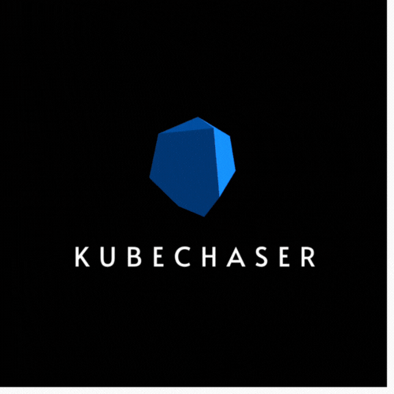

<p align="center">
  
</p>

[**KubeChaser**](https://kubechaser.dev) is a 3D renderer for visualizing Kubernetes clusters.


This project is currently in the pre-alpha stage. Many features are experimental and core functionality is still in active development.

## Install

1. Install `go` version `1.24.3` or higher.
2. Point your `kubectl` context to the Kubernetes cluster for visualizing.
3. Run the following command:
```bash
git clone https://github.com/kabicin/kubechaser.git; cd kubechaser; go run .
```

## Dependencies
- https://github.com/4ydx/gltext - created by @4ydx
    - this project uses Freetype-Go which is authored by David Turner, Robert Wilhelm, and Werner Lemberg under the FreeType License viewable at [licenses/github.com/4ydx/gltext/ftl.txt](licenses/github.com/4ydx/gltext/ftl.txt)
- https://github.com/go-gl/glfw - created by glfw3-go authors
- https://github.com/go-gl/gl - created by Eric Woroshow
- https://github.com/go-gl/mathgl - created by go-gl authors
- https://golang.org/x/image - created by Go authors

## License
Copyright (c) 2025 Kirby Chin. All rights reserved. This project is licensed under a BSD license.