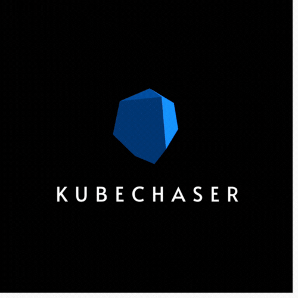

<p align="center">
  
</p>

[**KubeChaser**](https://kubechaser.dev) is a 3D renderer for visualizing Kubernetes clusters.

⚠️ **Note**  
> This project is under active development.

## Install
You will need `cmake`  and to install run 
```
git clone https://github.com/kabicin/kubechaser.git; cd kubechaser; ./scripts/build_and_run.sh
```

## Dependencies
- Eigen
- GLFW
- GLAD
- STB
- GLM
- Dear ImGUI
